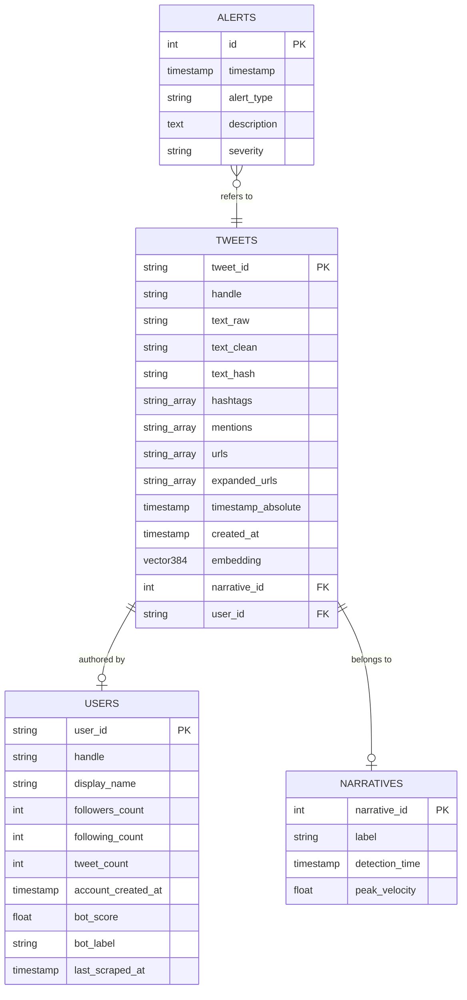

# 📊 SentinelGraph Database Schema

This document details the PostgreSQL database schema for the **SentinelGraph** narrative detection system. The database uses the `pgvector` extension for semantic search and narrative clustering.

## 🏗️ Entity Relationship Diagram

---

## 📝 Table Definitions

### 1. `tweets`
The core table storing ingested data from X (Twitter).

| Attribute | Type | Description |
| :--- | :--- | :--- |
| `tweet_id` | `VARCHAR` | Primary Key. The unique ID provided by X. |
| `handle` | `VARCHAR` | The Twitter handle (screen name) of the author. |
| `text_raw` | `TEXT` | Original, unmodified tweet text. |
| `text_clean` | `TEXT` | Text after normalization (emoji removal, etc.). |
| `text_hash` | `VARCHAR` | MD5/SHA hash of cleaned text for fast duplicate detection. |
| `hashtags` | `VARCHAR[]` | Array of extracted hashtags. |
| `mentions` | `VARCHAR[]` | Array of mentioned user handles. |
| `urls` | `VARCHAR[]` | Array of short URLs found in the tweet. |
| `expanded_urls` | `VARCHAR[]` | Array of resolved/expanded URLs. |
| `timestamp_absolute` | `TIMESTAMPTZ` | When the tweet was actually posted on X. |
| `created_at` | `TIMESTAMPTZ` | When the tweet was ingested into our system. |
| `embedding` | `VECTOR(384)` | Semantic vector generated via `all-MiniLM-L6-v2`. |
| `narrative_id` | `INTEGER` | ID of the narrative cluster (FK to `narratives`). |
| `user_id` | `VARCHAR` | ID of the user (FK to `users`). |

### 2. `users`
Profiles and intelligence scoring for accounts.

| Attribute | Type | Description |
| :--- | :--- | :--- |
| `user_id` | `VARCHAR` | Primary Key. Numeric X user ID or handle. |
| `handle` | `VARCHAR` | Current screen name. |
| `display_name` | `VARCHAR` | Profile display name. |
| `followers_count` | `INTEGER` | Number of followers. |
| `following_count` | `INTEGER` | Number of accounts followed. |
| `tweet_count` | `INTEGER` | Total lifetime tweets. |
| `account_created_at`| `TIMESTAMPTZ` | Date the account joined X. |
| `bot_score` | `FLOAT` | 0.0 to 1.0 probability of being a bot. |
| `bot_label` | `VARCHAR` | Classification: `ORGANIC`, `SUSPICIOUS`, `BOT`. |
| `last_scraped_at` | `TIMESTAMPTZ` | Last time the profile was updated. |

### 3. `alerts`
System-generated triggers for human review.

| Attribute | Type | Description |
| :--- | :--- | :--- |
| `id` | `SERIAL` | Primary Key. |
| `timestamp` | `TIMESTAMP` | When the alert occurred. |
| `alert_type` | `VARCHAR` | e.g., `VELOCITY_SPIKE`, `SENTIMENT_DROP`, `BOT_ATTACK`. |
| `description` | `TEXT` | Detailed reasoning for the alert. |
| `severity` | `VARCHAR` | `LOW`, `MEDIUM`, `HIGH`, `CRITICAL`. |

### 4. `narratives` (Planned)
Metadata for detected conversation clusters.

| Attribute | Type | Description |
| :--- | :--- | :--- |
| `narrative_id` | `INTEGER` | Primary Key. Generated by clustering engine. |
| `label` | `VARCHAR` | Human-readable or keyword-based topic label. |
| `detection_time` | `TIMESTAMPTZ` | When the cluster was first identified. |
| `peak_velocity` | `FLOAT` | Maximum tweets per minute observed. |

---

## 🔗 Connections & Indexing

1.  **Duplicate Detection**: indexed on `text_hash` and `tweet_id`.
2.  **Semantic Search**: HNSW or IVFFlat index on `tweets.embedding`.
3.  **Real-time Analysis**: Indexed on `tweets.timestamp_absolute` for time-range queries.
4.  **Bot Mapping**: Shared `user_id` between `tweets` and `users`.
